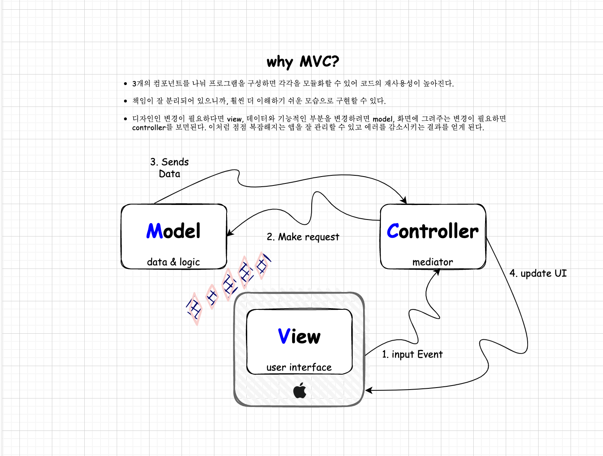

# MVC

model-view-controller 디자인 패턴은 데이터와 이를 처리하는 로직을 담는 영역, 인터랙션을 담당하는 유저 인터페이스 영역 그리고 이를 중재하는 영역으로 나눈 아키텍쳐 블루프린트입니다. 모델과 뷰는 직접 관여하지 않고 컨트롤러에 의해서 상호 동작하는 것이 특징입니다.

<figure><figcaption>
내 MVC
</figcaption></figure>

