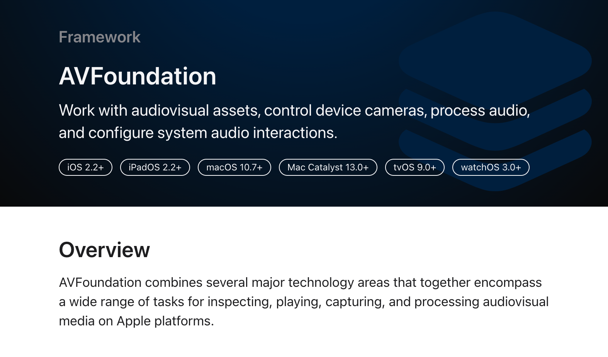

# cheet sheet

### Play Audio

<figure><figcaption></figcaption></figure>

```swift
import AVFoundation

var player: AVAudioPlayer!

func playSound() {

	// bundle is resources in the Disk
	guard let url = Bundle.main.url(forResouce: "", withExtension: "wav") { return }
	
	player = try! AVAudioPlayer(contentsOf: url)
	
	player.play()

}
```


### Timer

```swift
// 여러 타이머가 계속 생성되지 않도록 주의합니다.
var timer = Timer()

func startBtnPressed() {
	timer.invalidate()
	
	Timer.scheduledTimer(
		timeInterval: 1.0,
		target: self, 
		selector: #selector(updateTimer), 
		userInfo:nil, 
		repeats: true
	)
}

@objc func updateTimer() {
	if secondsRemaining > 0 {
		print("\\(secondsRemaining) seconds.")
		secondsRemaining -= 1
	} else {
		timer.invalidate()
	}
}
```


### Progress Percentage

```swift
// secondsPassed, totalTime는 Float type 이여야합니다.
percentageProgress = secondsPassed / totalTime
```


### Execute thread

```swift
DispatchQueue.main.async {
    // code
}

DispatchQueue.main.asyncAfter(deadline: .now() + 0.25) {
    // code
}
```


### type conversion

```swift
let pi: Double = 3.14159265

String(format: "%.f", pi)
// output: 3

String(format: "%.2f", pi)
// output: 3.14

String(format: "%.3f", pi)
// output: 3.142

```
